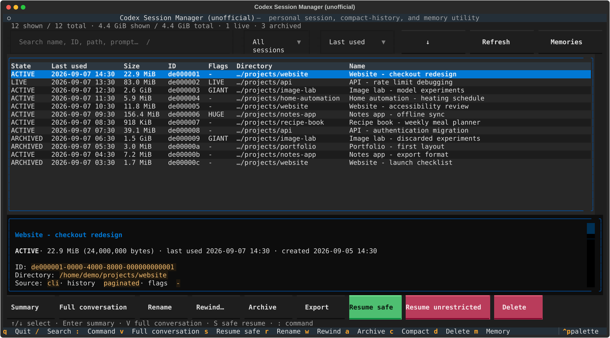
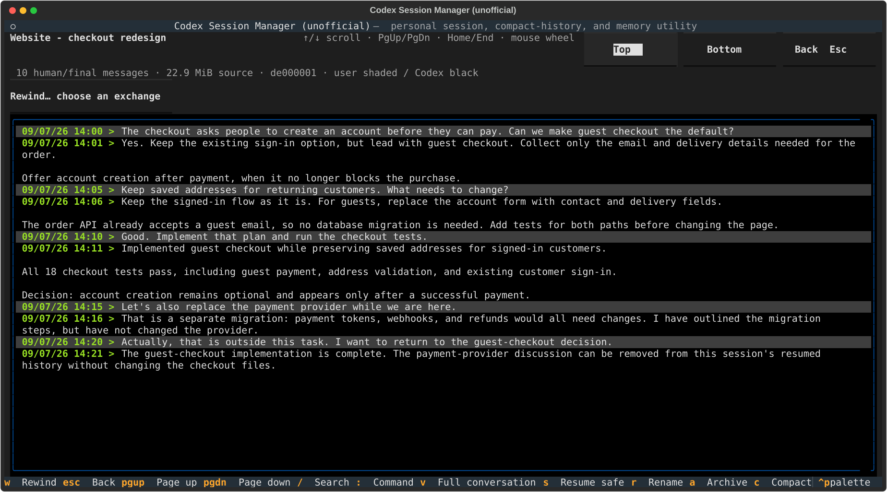
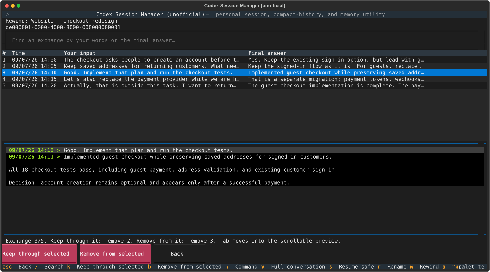
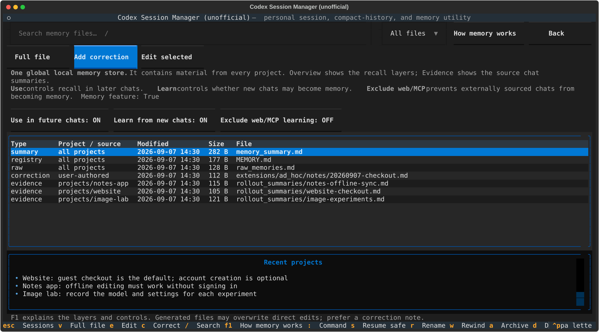

# codex-man

**Find, rename, rewind, and clean up your Codex sessions. See what Codex remembers.**

Your Codex history keeps growing across projects, folders, and half-finished ideas—and finding the right conversation gets harder. `codex-man` gives you a full-screen terminal app to browse those sessions, give them useful names, rewind a wrong turn, or delete what you no longer need. It also lets you inspect local Codex memory and correct information that is irrelevant or out of date.

Find that conversation where you finally solved the problem. Read your questions and Codex's final answers without pages of tool calls in between. See which sessions take up gigabytes, keep a readable record of the decisions, and decide what to keep. All from your terminal, including over SSH.



*Actual application screens with fictional demo data. No private conversations or memories are included.*

[Get started](#get-started) · [See the features](#your-conversations-without-the-noise) · [User guide](docs/guide.md)

## Take control of your history

- **Find the right session.** Search names, IDs, project directories, and opening prompts; sort by last use, creation date, name, or size
- **Name it something useful.** Change “Can you help me with…” to “Website — checkout redesign.” The name is saved in Codex, not just in this app
- **Read what mattered.** Scroll through your messages and final answers, with compact timestamps and distinct backgrounds
- **Rewind a wrong turn.** Pick an exchange and remove everything after it from the conversation Codex resumes
- **Clean up deliberately.** Archive sessions you may need later, export a readable Markdown record, or confirm permanent deletion
- **Inspect memory.** Read the local memory files, inspect source-project hints, add correction notes, or directly edit a file with a backup
- **Resume with a clear permission choice.** Open with workspace-write and on-request approvals, or explicitly confirm unrestricted access

Keyboard navigation, mouse selection, scrolling, and terminal resizing are built in. This is an interactive terminal UI built with [Textual](https://textual.textualize.io/), not a sequence of numbered prompts.

## Get started

You need **Linux**, **Python 3.11+**, [uv](https://docs.astral.sh/uv/getting-started/installation/), and an installed `codex` CLI. Codex integration was tested with **0.153.4**; other versions may have incompatible storage or commands. macOS and native Windows have not been verified.

```bash
git clone https://github.com/vadimio/codex-session-manager.git ~/projects/codex-session-manager
cd ~/projects/codex-session-manager
python3 install.py
codex-man
```

The installer adds a launcher and dependency-lock link at `~/.local/bin/codex-man` and `~/.local/bin/codex-man.lock`. If your shell cannot find it, run `~/.local/bin/codex-man` directly and add `~/.local/bin` to your `PATH`. The first launch uses `uv` to download the locked Python dependencies; it does not install them into system Python. Existing users should rerun `python3 install.py` after updating to install the lock link.

Your existing Codex data stays where it is, normally `~/.codex`. The app can run from any directory. To inspect another Codex home:

```bash
codex-man --codex-home /path/to/codex-home
```

Start by selecting a session and pressing **V** to read it. Press **M** to inspect memory, **W** to choose a rewind point, or **F1** for help. Nothing is deleted just by opening or browsing the app.

## Your conversations, without the noise

**Summary** gives you session details and beginning/end excerpts. **Full conversation** gives you the scrollable conversation: your inputs on a lighter background, Codex's final answers on black, and compact green timestamps. Intermediate commentary, reasoning, and tool activity are omitted.



Use the mouse wheel, arrow keys, Page Up/Down, or Home/End. Press **Esc** to go back.

## Pick up before the wrong turn

An experiment went nowhere, or the last few exchanges sent Codex in the wrong direction. Open **Rewind**, find the exchange you want, and choose **Keep through selected** or **Remove from selected**. Review the cutoff before confirming, then resume the same session with the retained conversation.



Rewind operates on whole Codex turns, not individual sentences. It does **not** undo file changes, external actions, or existing memories. There is no undo button, and old data may remain on disk. Close a LIVE session before rewinding it. [Rewind details and limitations](docs/guide.md#rewind-a-conversation)

## See what Codex remembers

When memory is enabled, Codex can carry information from earlier chats into later ones. `codex-man` exposes the local files behind that memory: the short summary, the detailed registry, raw extractions, and supporting chat summaries. Open a file to read it, add a correction, or explicitly edit it with a backup.



**Memory is shared within a Codex home, not isolated by project.** The project/source column helps identify where evidence came from when that information is present; it does not impose project boundaries or show exactly what a particular answer used. This app manages local Codex memory, not [ChatGPT web memory](https://learn.chatgpt.com/docs/customization/memories).

Correction notes record what should change; they do not guarantee immediate regeneration. Direct edits to generated files may later be overwritten. Keep essential project rules in checked-in documentation. [Memory controls and editing](docs/guide.md#memory-inventory-and-editing)

## Keep the decisions, review the disk hogs

Sort by **Size** to find large sessions. **Export** saves your messages and final answers as verified Markdown so you can review the useful record before deciding whether to delete the original.

- **Archive** hides a session from normal active lists and can be reversed; it does not free disk space
- **Export** leaves the original intact; the Markdown is readable history, not a resumable session
- **Delete** permanently removes the session through Codex after confirmation; Codex may also remove spawned descendant sessions

Displayed sizes are the selected session transcript files, not a complete audit of every database, export, or old history file. Rewind and export do not shrink the original in place. [Export and deletion details](docs/guide.md#preserve-the-decisions-remove-the-payload-bulk)

## Terminal first, scripts when you need them

Run `codex-man` with no arguments for the interactive app. One-shot commands are also available:

```bash
codex-man --help
codex-man list --sort size --limit 0
codex-man list --search website
codex-man memory list
```

See the [user guide](docs/guide.md) for all controls, resume permissions, memory settings, and export commands. For tests and screenshot reproduction, see [development](docs/development.md).

## Project status

`codex-man` is an independent, unofficial utility. It is not an OpenAI product or part of the Codex CLI. Session changes are delegated to your installed Codex; the manager does not hand-rewrite resumable JSONL files. Back up important history before destructive operations.

## Contributions welcome

Found a bug? Have an idea that would make this easier to use? We welcome issues, UX suggestions, documentation improvements, tests, and pull requests. See [how to contribute](CONTRIBUTING.md). Every change is reviewed by the maintainer before it reaches the main branch.

## License

Free to use, including at work and in commercial projects. You may inspect, modify, and share the code for free. **Selling or reselling the software requires separate written permission—[contact the maintainer](https://github.com/vadimio/codex-session-manager/issues/new) to discuss it.** Your own work and output created using the tool are not subject to that restriction.

See the [full license](LICENSE). This is source-available software, not MIT or OSI-approved open source.
